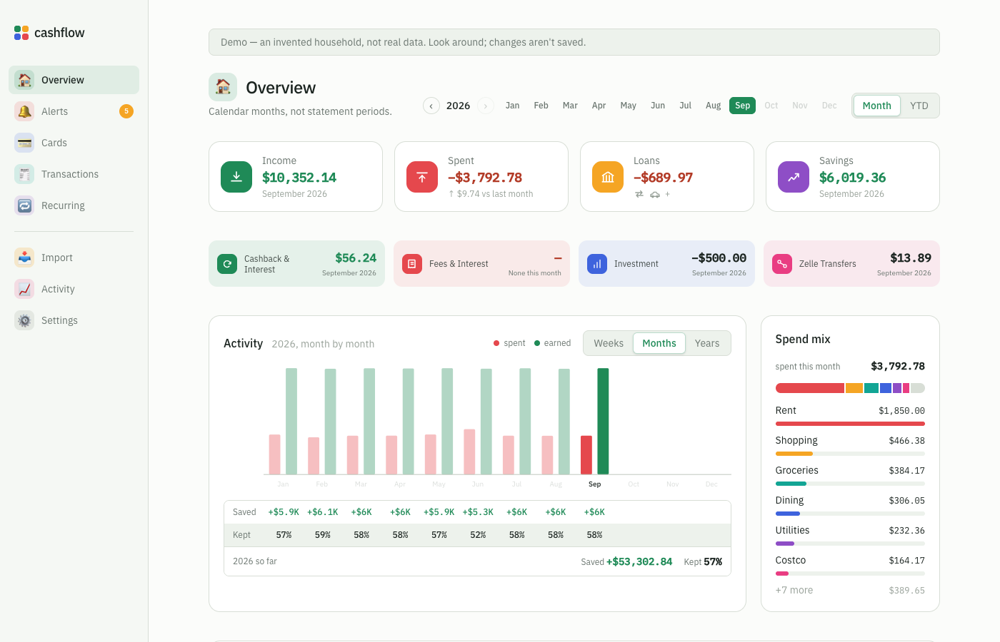
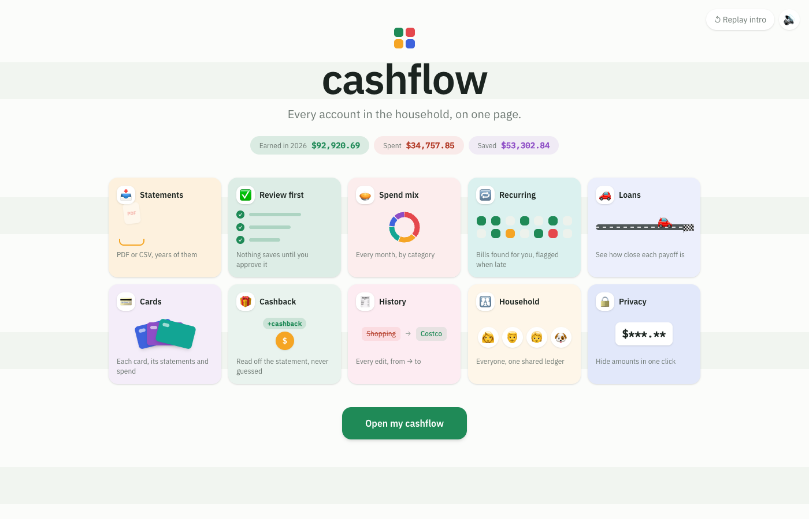

# cashflow

A household expense tracker that runs entirely on your own computer.
Upload your bank and card statements, check what was read, and see where
the money goes — by month, category, person and account. No bank logins,
no aggregators, no cloud: your statements and your database stay on your
machine.

**[Try the demo →](https://sujithsadineni.github.io/cashflow/)** — the real
app with an invented household, running in your browser. Nothing you do
there is saved.



## What it does

- **Statements in, transactions out.** PDF or CSV, years of them. Bank of
  America, Chase, American Express and Bilt PDFs are read locally; other
  PDFs can use Claude (optional API key).
- **Review before anything is saved.** Parsed rows wait in a review queue
  with duplicate detection, and only what you approve reaches the ledger.
- **Overview.** Income, spend, loans and savings for any month or the year so
  far, an activity chart, and a category breakdown.
- **Cards.** Every account with its transactions and a statement calendar
  that shows which months are uploaded, missing or not due yet.
- **Recurring bills,** detected from your history and shown on a calendar —
  paid, upcoming, or missed.
- **Loans,** tracked by hand (a car loan, a 0% balance transfer) with
  progress toward payoff.
- **Zelle** payments sorted into sent, received and transfers between you.
- **History.** Every edit is recorded, from → to.
- **Privacy mode** hides every amount with one click, for screenshots.
- **Two designs:** a quiet ledger-paper *Classic* and a colourful, animated
  *Vivid*.



## Set it up

You need **Node 22+** and **PostgreSQL 15+** (developed on Node 26 and
PostgreSQL 17). Pick whichever way suits you — all three end in the same place.

### With Claude Code

```sh
git clone https://github.com/sujithsadineni/cashflow.git && cd cashflow
claude
```

Then ask:

> Set this project up locally by following the "By hand" section of
> README.md, and tell me when the app is running.

Claude Code reads `CLAUDE.md` → `AGENTS.md` for the project's rules, so it
knows the conventions before it changes anything.

### With Codex

```sh
git clone https://github.com/sujithsadineni/cashflow.git && cd cashflow
codex
```

Ask the same thing. Codex reads `AGENTS.md` directly.

### By hand

1. **Database** — create it and apply every migration in order:

   ```sh
   createdb cashflow
   for f in db/*.sql; do psql -v ON_ERROR_STOP=1 -d cashflow -f "$f"; done
   ```

2. **API** (port 4000):

   ```sh
   cd api
   cp .env.example .env      # edit DATABASE_URL if your Postgres needs a user/password
   npm install
   npm run dev
   ```

3. **Web** (port 5173), in a second terminal:

   ```sh
   cd web
   npm install
   npm run dev
   ```

4. Open **http://localhost:5173**, add yourself under Settings → People, and
   upload a statement under Import.

Uploaded statements are kept in `data/statements/` at the repo root, which is
git-ignored. The Anthropic API key in `api/.env` is optional — see the
comment there.

## Tests

```sh
cd api && npm test
cd web && npm test
node --test scripts/
```

## The demo

The GitHub Pages demo has no server. `api/demo/seed.mjs` creates an
invented household in a separate `cashflow_demo` database,
`api/demo/record.mjs` drives the real app in headless Chrome and saves every
API response, and `npm run build:demo` builds a version of the web app that
replays those responses. Rebuild all of it with:

```sh
sh api/demo/rebuild.sh     # needs Postgres and Google Chrome; never touches `cashflow`
cd web && npm run build:demo
```

## Contributing

Read `AGENTS.md` first — especially the money rules. Turn on the pre-commit
hook once per clone; it blocks statements, `.env` files and anything that
looks like a card number or secret:

```sh
git config core.hooksPath .githooks
```

How the pieces fit: [`guide/ARCHITECTURE.md`](guide/ARCHITECTURE.md). Why
things are the way they are: [`guide/DESIGN-NOTES.md`](guide/DESIGN-NOTES.md).

## License

[MIT](LICENSE)
